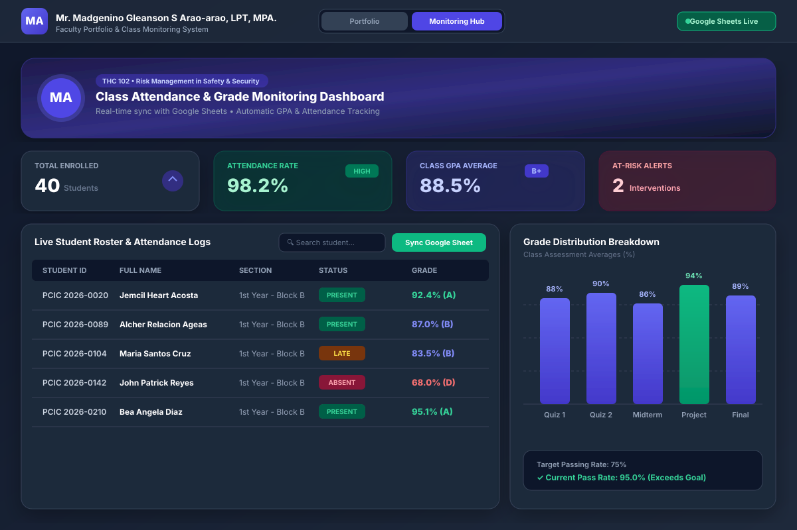

# Class Attendance & Gradebook Monitoring Dashboard



A real-time web application dashboard designed for instructors to track class attendance, student grades, GPA analytics, and at-risk student interventions—powered by **Google Sheets** for data storage and hosted on **Cloudflare Pages**.

---

## 🌟 Key Features

1. **Live Google Sheets Synchronization**
   - Fetches published CSV data or Apps Script JSON endpoints from Google Sheets.
   - Automatically maps student IDs, names, attendance dates, and numerical grades.

2. **Attendance Tracker**
   - Supports Present, Late, Absent, and Excused status tags.
   - Allows section filtering, date picking, and quick table scroll controls.

3. **Gradebook & Score Management**
   - Calculates weighted grades based on Quizzes, Midterms, Projects, and Finals.
   - Automatically computes GPA letter grades (A, B, C, D, F).

4. **Performance Visualizations & Analytics**
   - Interactive Chart.js breakdown for grade distribution.
   - Assessment comparisons across quizzes, midterms, and final exams.

5. **At-Risk & Interventions**
   - Automatically identifies students with low attendance (<75%) or failing grades (<70%).

6. **Instructor Lock Security**
   - Includes PIN authentication (`2026-PCIC-ADMIN`) to switch between View-Only mode and Instructor Edit mode.

---

## 🚀 How to Deploy on Cloudflare Pages

### Option 1: Direct Upload (Fastest)

1. Go to your [Cloudflare Dashboard](https://dash.cloudflare.com/) and navigate to **Workers & Pages**.
2. Click **Create Application** > **Pages** > **Upload assets**.
3. Set your project name (e.g. `class-monitoring-dashboard`).
4. Drag and drop the `MGraoarao Portfolio and CLass Monitoring` folder contents (`index.html`, `app.js`, `profile.jpg.jpg`, etc.).
5. Click **Deploy Site**. Your dashboard will be live at `https://class-monitoring-dashboard.pages.dev`.

### Option 2: Wrangler CLI Deployment

Run the following command using the Wrangler CLI:

```bash
npx wrangler pages deploy . --project-name=class-monitoring-dashboard
```

### Option 3: Git Integration (Continuous Deployment)

1. Push this repository to **GitHub** or **GitLab**.
2. Go to **Workers & Pages** in Cloudflare.
3. Click **Connect to Git** and select your repo.
4. Set **Build output directory** to `.`.
5. Click **Save and Deploy**. Any future Git commit will automatically re-deploy your dashboard.

---

## 📊 Google Sheets Integration Setup

### Method A: Publishing CSV (Read-Only Live Sync)

1. Open your Google Sheet.
2. Go to **File > Share > Publish to web**.
3. Select your worksheet tab (e.g., `Master_List` or `Attendance`) and choose **Comma-separated values (.csv)**.
4. Click **Publish** and copy the link into `DEFAULT_GSHEETS_CONFIG` inside `app.js`.

### Method B: Google Apps Script Web App (2-Way Sync)

1. Open your Google Sheet.
2. Click **Extensions > Apps Script**.
3. Copy the contents of `google-apps-script.gs` into the editor.
4. Click **Deploy > New deployment**.
5. Select **Web app**, set **Execute as: Me**, and **Who has access: Anyone**.
6. Copy the deployment URL and replace `scriptUrl` in `app.js`.

---

## 📁 File Structure

```
├── index.html            # Main UI HTML layout (Tailwind CSS, Lucide icons, Chart.js)
├── app.js                # Core JS logic, state management, CSV parsing, Chart rendering
├── google-apps-script.gs # Apps Script backend snippet for Google Sheets
├── wrangler.toml         # Cloudflare Pages deployment configuration
└── profile.jpg.jpg       # Profile picture asset
```

---

## 🔐 Default Access PIN

- **Instructor Admin PIN**: `2026-PCIC-ADMIN`
